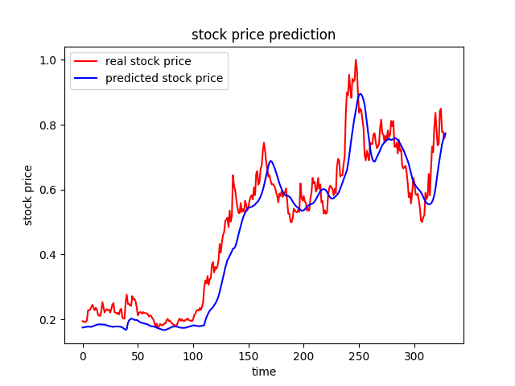

# Prediction

## RNN prediction

This is an example of stock price forecasting using LSTM (Long/Short Term Memory) using Keras built into tensorflow.
using 21 days of OHLCV data from market prices, dataset is used for training and testing at a 7:3 ratio.

The activation function was set to ReLU, the number of units was set to 21(days), the number of learning was set to 100, the dropout was set to 10%, the optimization was adam, and the loss function used an Mean squared error (MSE).

- example of prediction: KRX:000150, Forecast data for March 30

